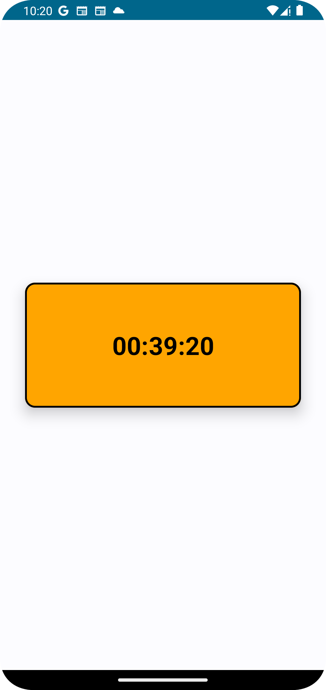

# CountdownTimer
This is a simple Android application that demonstrates a countdown timer functionality.

## Setup
To set up and run this project on your local machine, follow these steps:

1. Clone the repository:
> git clone <https://github.com/KennethMathari/CountdownTimer>
2. Open the project in Android Studio.
- Launch Android Studio and select Open an existing Android Studio project. Then navigate to the directory where you cloned the repository and select the project.
3. Sync Gradle files:
- After opening the project, Gradle will automatically start syncing. Wait for the process to finish.

## Build and Run
After opening the project, build and run to install the app in the emulator or a connected device.

## App Features
- Count the time left until the device is locked in the format hh:mm:ss finishing at 00:00:00
- Change color from green to orange to warn users that they need to pay soon
- Change color to red once 00:00:00 is reached.

## Dependencies
This project uses the following dependencies:
1. <b>[Jetpack Compose](https://developer.android.com/develop/ui/compose)</b>: Android’s recommended modern toolkit for building native UI.
2. <b>[Dagger Hilt](https://developer.android.com/training/dependency-injection/hilt-android)</b>: Hilt is a dependency injection library for Android that reduces the boilerplate of doing manual dependency injection in your project.
3. <b>[JUnit](https://junit.org/junit4/)</b>: a simple framework to write repeatable tests.
4. <b>[Mockk](https://mockk.io/)</b>:mocking library for Kotlin.
5. <b>[Kotlinx-Coroutines-Test](https://kotlinlang.org/api/kotlinx.coroutines/kotlinx-coroutines-test/)</b>: This package provides utilities for efficiently testing coroutines.
6. <b>[Turbine](https://github.com/cashapp/turbine)</b>: A small testing library for kotlinx.coroutines Flow. 

Other dependencies listed in the build.gradle files.

## App Screenshots
> 

<b>Note</b>: Make sure you have the necessary Android SDK components installed and configured in Android Studio before running the project. You may also need to update the dependencies in the build.gradle files to match the latest versions available.